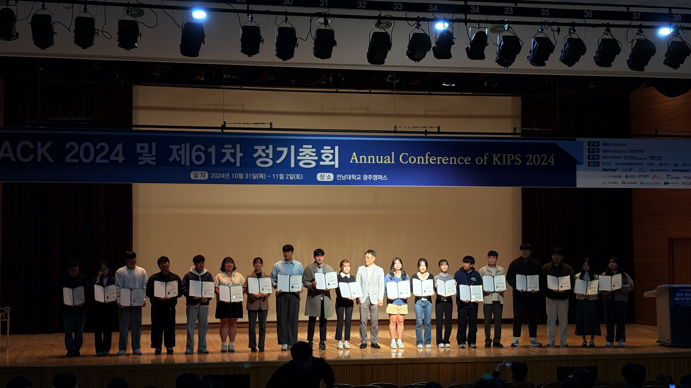
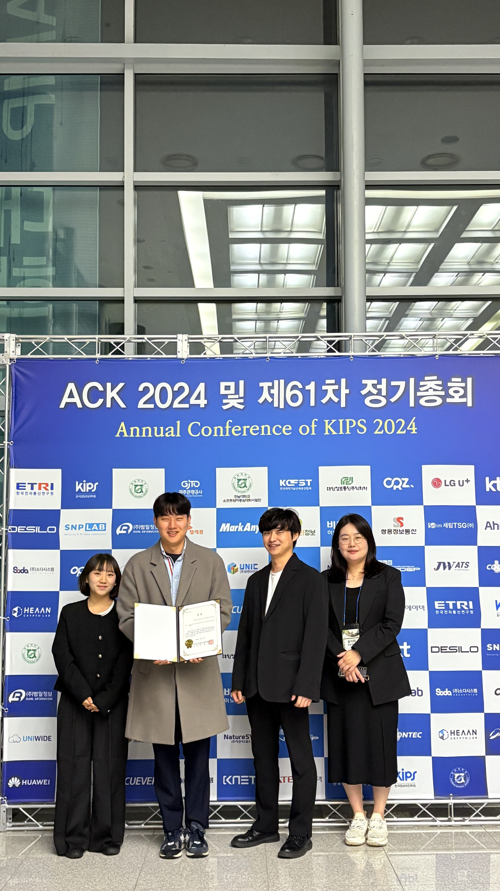
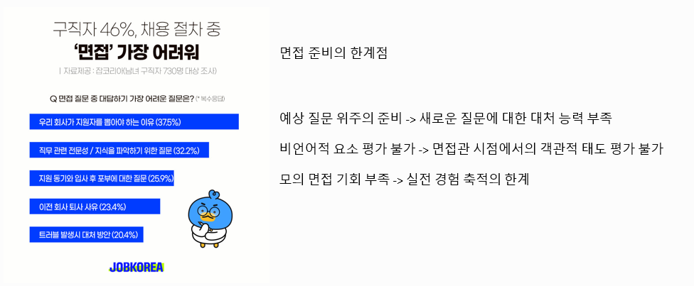
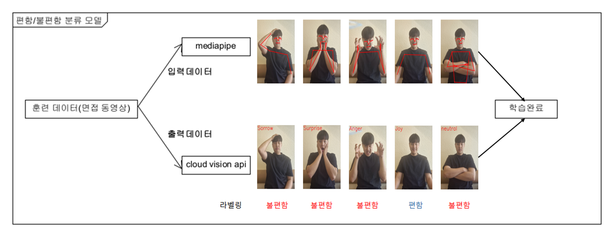
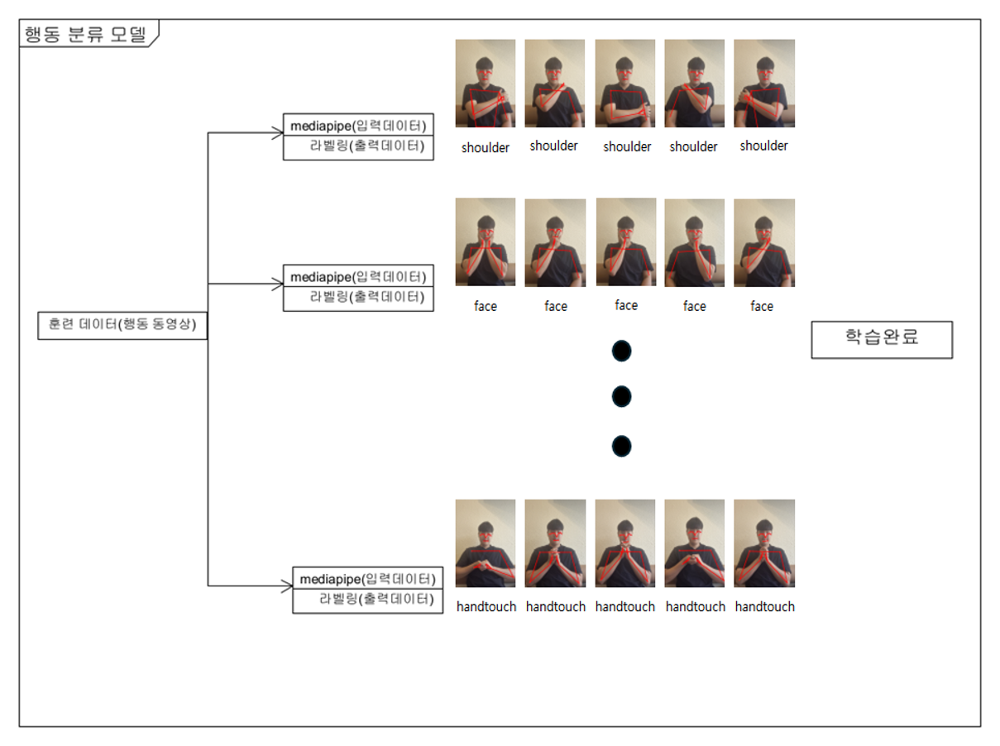
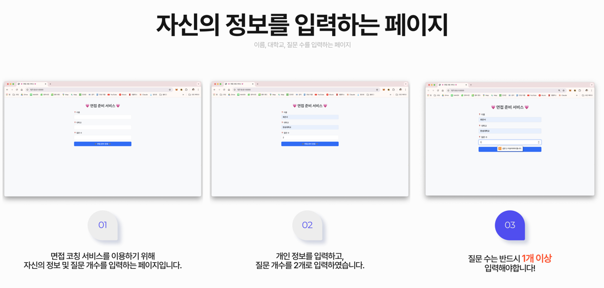
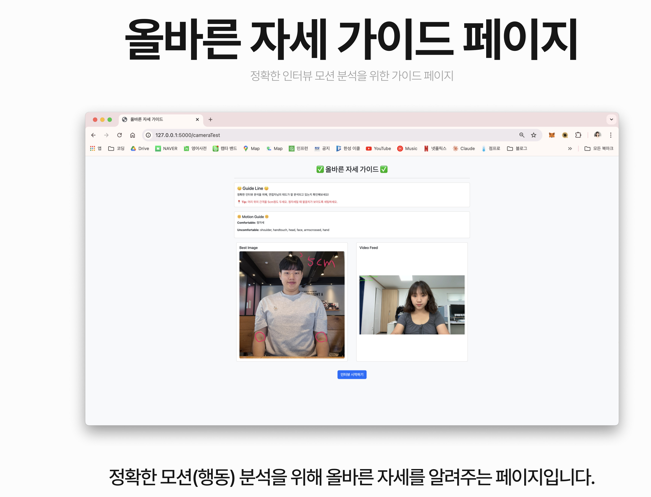
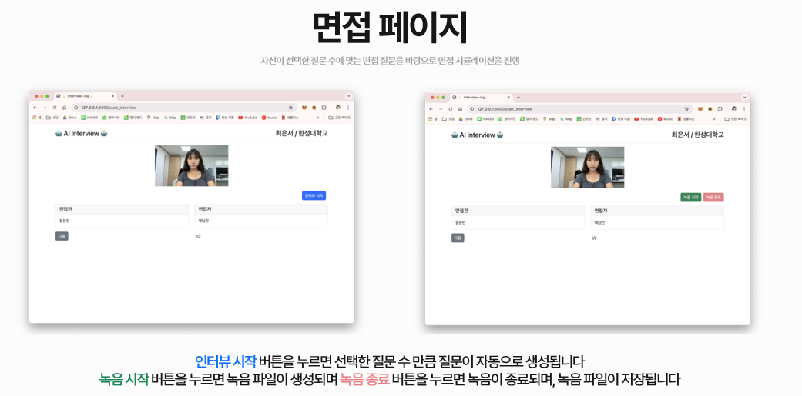
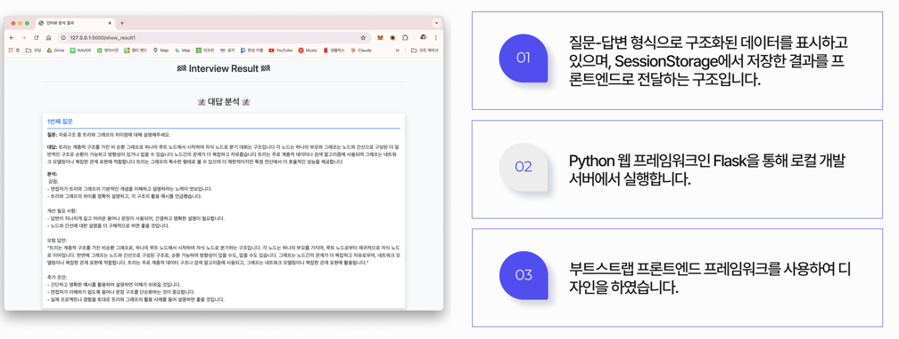
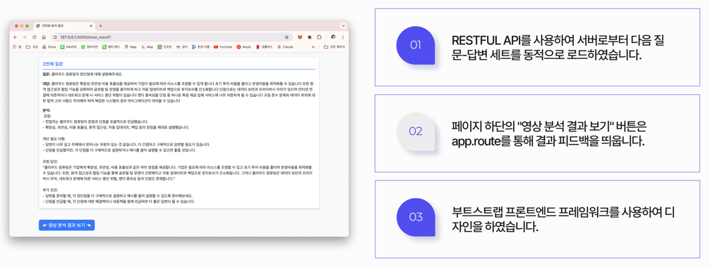

# 🎤 AI Interview Coaching System

<div align="center">



### 언어적·비언어적 커뮤니케이션 분석 기반 실시간 면접 코칭 시스템

[](docs/papers/논문_학교명제거.pdf)
[](docs/papers/발표자료_학교명제거.pdf)
[](https://www.python.org/)
[](https://flask.palletsprojects.com/)

</div>

---

## 📋 목차

- [프로젝트 개요](#-프로젝트-개요)
- [수상 및 발표](#-수상-및-발표)
- [연구 배경](#-연구-배경)
- [주요 기능](#-주요-기능)
- [AI 모델 아키텍처](#-ai-모델-아키텍처)
- [기술 스택](#기술-스택)
- [시스템 아키텍처](#️-시스템-아키텍처)
- [서비스 화면](#-서비스-화면)
- [성과 및 결과](#-성과-및-결과)
- [팀 구성](#-팀-구성)
- [관련 자료](#-관련-자료)

---

## 🎯 프로젝트 개요

**AI Interview Coaching System**은 취업 준비생들을 위한 AI 기반 면접 연습 및 피드백 서비스입니다. 

기존 면접 준비 서비스의 한계(답변 위주의 제한적 피드백, 한정된 질문, 비언어적 행동 분석 부재)를 극복하기 위해, **언어적 요소**(답변 내용)와 **비언어적 요소**(자세, 표정, 행동 패턴)를 종합적으로 분석하여 실시간 피드백을 제공합니다.

### 프로젝트 기간
**2024년 6월 ~ 2024년 12월** (6개월)

### 핵심 특징
- 🤖 **GPT-3.5 기반 동적 질문 생성** - 매번 새로운 면접 질문
- 🎤 **음성 인식 기반 답변 분석** - Google STT 활용
- 📹 **자체 제작 AI 모델을 통한 행동 분석** - 면접 자세 및 행동 패턴 분석
- 📊 **실시간 시각화 피드백** - Chart.js 기반 분석 결과 제공

---

## 🏆 수상 및 발표

### ACK 2024 한국정보처리학회 추계학술발표대회

<div align="center">



</div>

| 구분 | 내용 |
|------|------|
| **대회명** | ACK 2024 (Annual Conference of KIPS 2024) |
| **주최** | 한국정보처리학회 |
| **일시** | 2024년 10월 31일(목) ~ 11월 2일(토) |
| **장소** | 전남대학교 광주캠퍼스 |
| **발표 세션** | S7. 인간-컴퓨터 상호작용 |
| **발표일** | 2024년 11월 1일 |
| **수상** | **🥉 학부생논문경진대회 동상** |

<div align="center">


*발표 현장*


*시상식*

</div>

### 학술 논문 게재

- **논문 제목**: 언어적·비언어적 커뮤니케이션 분석 기반 실시간 면접 코칭 시스템
- **게재지**: 한국정보처리학회 2024년 추계학술발표대회 논문집
- **저자**: 홍혜창, 전상우, 최은서, 송미화
- **PDF**: [📄 논문 보기](docs/papers/논문_학교명제거.pdf) | [📊 발표자료 보기](docs/papers/발표자료_학교명제거.pdf)

---

## 🔍 연구 배경

### 면접 준비의 현실

<div align="center">



</div>

### 기존 서비스의 한계점

| 문제점 | 설명 |
|--------|------|
| **예상 질문 위주의 준비** | 새로운 질문에 대한 대처 능력 부족 |
| **비언어적 요소 평가 불가** | 면접관 시점에서의 객관적 태도 평가 불가능 |
| **모의 면접 기회 부족** | 실전 경험 축적의 한계 |
| **제한적 피드백** | 답변 내용에만 집중, 종합적 분석 부재 |

취업 시장의 경쟁이 심화되면서 면접의 중요성은 커지고 있지만, 기존 면접 지원 도구는 실제 면접 환경을 충분히 반영하지 못하고 있습니다.

### 우리의 솔루션

이러한 한계를 극복하기 위해, **AI 기술을 활용한 종합적인 면접 분석 시스템**을 개발했습니다.

---

## ✨ 주요 기능

### 1️⃣ 동적 질문 생성 (GPT-3.5 Turbo)

```
🤖 GPT API + 프롬프트 엔지니어링
```

- **컨텍스트 설정 (Context Setting)**: 컴퓨터 공학 전공 키워드 학습
- **프롬프트 튜닝**: 10개 질문 생성 후 중복 검증 및 랜덤 선택
- **Few-shot 학습**: 구조화된 출력 예시 제공으로 일관된 형식 유지

**효과**: 매번 다른 질문으로 실전 대비 능력 향상

---

### 2️⃣ 음성 인식 기반 답변 분석

```
🎤 Google Speech-to-Text API
```

- **특징**:
  - 120개 이상 언어 지원
  - 실시간 스트리밍 인식
  - 녹음 시작/종료 버튼으로 음성 입력
  - 답변을 자동으로 텍스트로 변환

**효과**: 면접 질문에 대한 응답 기록 자동화

---

### 3️⃣ 자체 제작 행동 분석 AI 모델 ⭐

```
🎯 핵심 차별화 기능
```

#### 개발 목적
1. 면접자의 비언어적 행동을 통한 태도 분석
2. 불편해 보이는 행동 식별 및 피드백 제공
3. 편안/불편한 태도의 비율 및 세부 행동 분석
4. 실제 면접 대비를 위한 객관적 피드백 제공

#### 핵심 아이디어: 감정-행동 연관성 활용

> **불편한 행동 → 불편한 표정**  
> **불편한 표정 → 불편한 행동**

이 개념을 활용하여 특정 행동이 편안한지 불편한지 분류하는 모델을 개발했습니다.

---

## 🤖 AI 모델 아키텍처

### Two-Stage Classification Pipeline

<div align="center">


*1단계: 편안/불편함 분류 모델*


*2단계: 행동 분류 모델*

</div>

### 1단계: 편안/불편함 이진 분류

**목적**: 면접자의 전반적인 태도가 편안한지 불편한지 분류

**입력**: MediaPipe를 통한 자세 벡터 (132차원)
- 33개 관절 × (x, y, z, visibility) = 132차원 벡터

**출력**: `comfortable` 또는 `uncomfortable`

**특징**: 
- Google Cloud Vision API를 통한 얼굴 감정 분석 결과 활용
- 감정 표현과 신체 언어의 연관성 활용
- Joy, Sorrow, Anger, Surprise 등 4가지 감정 분석

---

### 2단계: 행동 세부 분류 (6가지)

**목적**: 구체적인 불편한 행동 유형 파악

**입력**: MediaPipe 자세 벡터 (uncomfortable로 분류된 경우에만)

**출력**: 6가지 행동 카테고리 중 1개
1. `hand` - 손 움직임
2. `face` - 얼굴 만지기
3. `head` - 머리 만지기
4. `arm` - 팔짱 끼기
5. `shoulder` - 어깨/팔 만지기
6. `handtouch` - 양손 모으기 및 만지기

**활용**:
- 실시간 면접 영상 분석
- 편안/불편한 행동 비율 산출
- 불편 행동 유형별 세부 비율 분석
- 비율 데이터 기반 맞춤형 피드백 제공
- 시각화된 결과 제공 (원형 그래프, 막대 그래프)

---

### 모델 선정: SVM (Support Vector Machine)


#### 성능 비교 (3가지 모델 테스트)

**1단계 모델 (편안/불편함 분류)**

| Model | Precision | Recall | Accuracy | F1 |
|-------|-----------|--------|----------|-----|
| RandomForest | 99.18% | 99.59% | 99.59% | 99.39% |
| **SVM** | **99.92%** | **91.99%** | **95.96%** | **95.79%** |
| LightGBM | 99.61% | 93.98% | 96.80% | 96.70% |

**2단계 모델 (행동 분류)**

| Model | Precision | Recall | Accuracy | F1 |
|-------|-----------|--------|----------|-----|
| RandomForest | 20.43% | 20.43% | 99.59% | 20.43% |
| **SVM** | **53.96%** | **46.04%** | **95.96%** | **49.68%** |
| LightGBM | 58.07% | 41.93% | 96.80% | 48.72% |

#### SVM 선정 이유

1. **균형 잡힌 성능**: 두 모델 모두에서 안정적인 성능 (RandomForest는 2단계에서 성능 저하)
2. **적은 데이터에 강함**: 자체 촬영 훈련 데이터로 높은 정확도 달성
3. **전반적인 행동 인식 능력**: 다양한 행동 패턴을 효과적으로 분류

---

### 사용 기술

#### MediaPipe Pose

```python
# 33개 관절의 3D 좌표 추출
pose_vector = [x, y, z, visibility] × 33 = 132차원
```

- Google의 모션 AI 프레임워크
- 실시간 포즈 추정
- 경량화된 모델로 빠른 처리

#### Google Cloud Vision API

```python
# 얼굴 감정 분석
emotions = [Joy, Sorrow, Anger, Surprise]
```

- 얼굴 근육 패턴 분석
- 4가지 감정 분류
- 대규모 데이터셋으로 학습된 모델 활용

---

## 기술 스택

### Backend

| 기술 | 용도 |
|------|------|
| **Flask** | 웹 프레임워크 |
| **Python 3.x** | 백엔드 개발 언어 |
| **OpenCV** | 비디오 처리 및 웹캠 제어 |
| **MediaPipe** | 포즈 추정 및 랜드마크 추출 |
| **scikit-learn** | 머신러닝 모델 (SVM) |
| **joblib** | 모델 저장/로드 |

### Frontend

| 기술 | 용도 |
|------|------|
| **HTML5/CSS3** | 마크업 및 스타일링 |
| **JavaScript (ES6)** | 클라이언트 로직 |
| **Bootstrap 5** | 반응형 UI 프레임워크 |
| **Chart.js** | 데이터 시각화 |

### AI & APIs

| 서비스 | 용도 |
|--------|------|
| **OpenAI GPT-3.5 Turbo** | 질문 생성 및 답변 분석 |
| **Google Speech-to-Text** | 음성 → 텍스트 변환 |
| **Google Cloud Vision API** | 얼굴 감정 분석 |
| **MediaPipe** | 포즈 추출 |

### 데이터 저장

- **SessionStorage** (클라이언트): 사용자 정보, 질문/답변 임시 저장
- **파일 시스템** (서버): 비디오/오디오 파일 저장
- ❌ **데이터베이스 미사용**: 영구 저장 불필요

---

## 🏗️ 시스템 아키텍처

### 혼합 아키텍처 (MVC + RESTful API)

```
┌─────────────────────────────────────────────────────────┐
│                  Client (Browser)                       │
│  ┌──────────┐  ┌──────────┐  ┌──────────┐               │
│  │HTML/CSS  │  │JavaScript│  │ Chart.js │               │
│  │(Jinja2)  │  │  (Fetch) │  │ (Graphs) │               │
│  └──────────┘  └──────────┘  └──────────┘               │
└─────────────────────────────────────────────────────────┘
                          ↓ HTTP
┌─────────────────────────────────────────────────────────┐
│                  Server (Flask)                         │
│  ┌───────────────────────────────────────────────────┐  │
│  │         Routes (Controller)                       │  │
│  │  - render_template(): MVC                         │  │
│  │  - jsonify(): RESTful API                         │  │
│  └───────────────────────────────────────────────────┘  │
│  ┌───────────────────────────────────────────────────┐  │ 
│  │         Business Logic (Model)                    │  │
│  │  - myGPT.py: GPT API 호출                         │  │
│  │  - swMotionFeedback.py: 영상 분석                 │  │
│  │  - hyechangMediapipe.py: 포즈 추출                │  │
│  └───────────────────────────────────────────────────┘  │
│  ┌───────────────────────────────────────────────────┐  │
│  │         AI Models (Pre-trained)                   │  │
│  │  - modelTest.joblib: 편안/불편 분류 (25KB)         │  │
│  │  - hyechangTraning.joblib: 행동 분류 (1.4MB)       │  │
│  └───────────────────────────────────────────────────┘  │ 
└─────────────────────────────────────────────────────────┘
                          ↓
┌─────────────────────────────────────────────────────────┐
│           External APIs & Services                      │
│  - OpenAI GPT-3.5 API                                   │
│  - Google Speech Recognition API                        │
│  - Google Cloud Vision API                              │
└─────────────────────────────────────────────────────────┘
```

### 전체 시스템 흐름

```
1. 정보 입력 (information.html)
   ↓
2. 카메라 테스트 (cameraTest.html)
   ↓
3. 면접 진행 (interview.html)
   - 질문 생성 (GPT)
   - 음성 녹음 및 텍스트 변환 (Google STT)
   - 비디오 녹화 (OpenCV)
   ↓
4. 답변 분석 (showResult1.html)
   - GPT 기반 답변 피드백 (병렬 처리)
   - AI 모델 기반 영상 분석 (병렬 처리)
   ↓
5. 결과 시각화 (showResult2.html)
   - Chart.js 그래프 생성
```

---

## 💻 서비스 화면

### 1단계: 초기 정보 입력

<div align="center">


*이름, 학교, 질문 수 입력 화면*

</div>

- 사용자 정보 입력
- 면접 질문 개수 설정 (2개 이상)
- SessionStorage에 데이터 저장

---

### 2단계: 올바른 자세 가이드

<div align="center">


*정확한 모션 분석을 위한 자세 가이드*

</div>

**가이드 내용**:
- 머리 위 간격 5cm 유지
- 정자세 시 팔꿈치가 보이도록 설정
- 실시간 AI 분석 결과 확인

**표시 정보**:
- `Comfortable`: 정자세
- `Uncomfortable`: 불편한 자세 (shoulder, handtouch, head, face, armscrossed, hand)

---

### 3단계: 면접 진행

<div align="center">


*실시간 면접 진행 화면*

</div>

**흐름**:
1. **인터뷰 시작** 버튼 클릭
   - 비디오 녹화 시작
   - GPT 질문 생성 (10개 중 랜덤 선택)
   - 첫 번째 질문 표시

2. **녹음 시작** 버튼 클릭
   - 마이크 녹음 시작
   - 사용자 답변

3. **녹음 종료** 버튼 클릭 (3초 대기 후)
   - 음성 → 텍스트 변환
   - 화면에 답변 표시

4. **다음** 버튼으로 다음 질문 진행

5. 마지막 질문 완료 시 **결과보기** 버튼 활성화

---

### 4단계: 답변 분석 결과

<div align="center">


*질문별 답변 분석 (1)*


*질문별 답변 분석 (2)*

</div>

**GPT 기반 답변 분석**:
- **강점**: 잘한 부분 강조
- **개선 필요 사항**: 구체적인 개선점 제시
- **모범 답안**: 참고할 수 있는 이상적인 답변
- **추가 조언**: 면접 준비를 위한 실질적 팁

**처리 방식**:
- 각 질문/답변 쌍에 대해 병렬로 GPT API 호출
- Few-shot 학습으로 일관된 피드백 형식 유지

---

### 5단계: 모션 분석 결과

<div align="center">


*비언어적 행동 분석 결과 및 시각화*

</div>

**분석 내용**:
1. **편안/불편함 비율** (원형 그래프)
   - 전체 면접 중 편안한 자세 vs 불편한 자세 비율

2. **불편한 행동 세부 분류** (막대 그래프)
   - 손 움직임, 얼굴 만지기, 머리 만지기 등 6가지 행동 비율

3. **GPT 생성 종합 피드백**
   - 전체 태도 평가
   - 가장 두드러진 불편한 행동 분석
   - 긍정적인 측면 강조
   - 개선을 위한 실천적 조언


---

## 📊 성과 및 결과

### 학술적 성과

✅ **한국정보처리학회 ACK 2024 학부생논문경진대회 동상 수상**  
✅ **학술논문 게재** - 한국정보처리학회 논문집  
✅ **학술대회 발표** - S7. 인간-컴퓨터 상호작용 세션

### 기술적 성과

✅ **자체 AI 모델 개발** - SVM 기반 2단계 행동 분류 시스템  
✅ **95.96% 정확도** 달성 (편안/불편함 분류)  
✅ **실시간 분석 시스템** - MediaPipe + OpenCV 활용  
✅ **프롬프트 엔지니어링** - GPT-3.5 최적화

### 프로젝트 차별점

| 기존 서비스 | 본 프로젝트 |
|------------|-----------|
| 예상 질문 중심 | **동적 질문 생성** (GPT) |
| 답변만 평가 | **언어적 + 비언어적 종합 평가** |
| 주관적 피드백 | **AI 기반 객관적 분석** |
| 일회성 연습 | **반복 연습 + 개선 추적 가능** |

---

## 👥 팀 구성

<div align="center">

| 이름 | 역할 | 담당 업무 |
|------|------|----------|
| **홍혜창** | 백엔드 개발 | Flask 서버 구축, API 설계, 시스템 통합 |
| **전상우** | AI 모델 개발 | SVM 모델 학습, 데이터 수집, 모델 최적화 |
| **최은서** | 프론트엔드 개발 | UI/UX 디자인, HTML/CSS/JavaScript |
| **송미화 교수** | 지도교수 | 프로젝트 총괄 지도 |

</div>

---

## 📚 관련 자료

### 📄 논문 및 발표자료

- [📑 학술논문 PDF](docs/papers/논문_학교명제거.pdf)
- [📊 발표자료 PDF](docs/papers/발표자료_학교명제거.pdf)

### 💻 소스코드

- [📦 GitHub Repository - AI-Interview-Service](https://github.com/AI-Interview-Coach/AI-Interview-Service)
  - 전체 소스코드
  - 기술 문서
  - 실행 방법

---


<div align="center">

### 🌟 AI Interview Coaching System

**언어적·비언어적 커뮤니케이션 분석으로 더 나은 면접을 준비하세요**

Made with ❤️ by Team TACO

</div>


